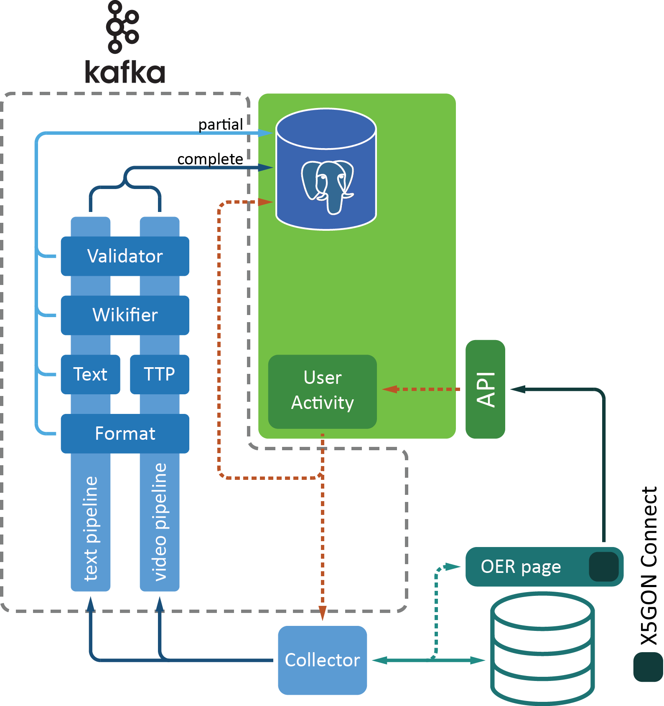

# X5GON Processing Pipelines


[](https://opensource.org/licenses/BSD-2-Clause)

This project contains the code base for OER material processing pipeline. The
pipeline is created using qtopology which is a distributed stream processing layer.

For the full documentation check the projects [wiki pages](https://github.com/X5GON/processing-pipeline-api/wiki).



*Figure 1:* The material processing pipeline architecture. It shows how we acquire
materials via different APIs and send them to the appropriate pipeline based on the
material's type.


## Prerequisites

### Apache Kafka and Docker

The material processing pipeline is dependent on Apache Kafka. One can install
an instance of Apache Kafka on their machine - what we prefer is to use a docker
container which includes Apache Kafka.

### Textract

The pipeline uses a nodejs module called [textract](./pkgs/textract) which allows
text extraction of most of text files. For some file types additional libraries need to be installed:

- **PDF** extraction requires `pdftotext` be installed, [link](http://www.xpdfreader.com/download.html).
- **DOC** extraction requires `antiword` be installed, [link](http://www.winfield.demon.nl/), unless on OSX
    in which case textutil (installed by default) is used.

#### Installing and Running Docker

It is required to have a running kafka container before running the processing pipeline. For instructions see the [Docker readme](./docker).


## Running Material Processing Pipeline Components

The material processing pipeline is structured of multiple components.

### Material Collector

```bash
# start the material collector process
node ./material-collector.js
```

```bash
# start the material collector process with node process manager
pm2 start ecosystem.collecting.config.json
```

### Material Processing Components

```bash
cd pipelines
# start the text material processing pipeline
TOPOLOGY=processing-material-text node ./pipeline.js

# start the video and audio processing pipeline
TOPOLOGY=processing-material-video node ./pipeline.js
```
```bash
# start all processing components with node process manager
pm2 start ecosystem.processing.config.json
```

### Material and Other Data Storing Components

```bash
cd pipelines
# start the complete material storing process
TOPOLOGY=storing-material-complete ./pipeline.js

# start the partial material storing process
TOPOLOGY=storing-material-partial ./pipeline.js

# start the user activities storing process
TOPOLOGY=storing-user-activities ./pipeline.js

# start the recommender system transitions storing process
TOPOLOGY=storing-recsys-transitions ./pipeline.js

# start the OER provider storing process
TOPOLOGY=storing-providers ./pipeline.js
```

```bash
# start all storing components with node process manager
pm2 start ecosystem.storing.config.json
```


## Folder Structure

The folder structure is as follows:

| folder name | description |
| ----------- | ----------- |
| docker      | Contains the instructions on how to start Apache Kafka Docker image                          |
| env         | Contains the instructions on how to create the environment variables for the project         |
| schemas     | Contains the schemas used to validate the material structure                                 |
| src         | Contains the topology components and configurations                                          |
| topologies  | Contains the topologies that define how the pipelines are structured together                |


## Processing Pipelines

The processing pipelines accept Open Educational Materials of a particular *type*
and process it accordingly. The two types that are currently supported are:

- text
- video/audio


### Pipeline Components

Each pipeline contains the following components:

- **Format.** Formats the acquired materials into a common schema.
- **Content Extraction.** Extracts the content from the material. This is done
    based on the material type:
    - **Text.** We use *textract*, a Nodejs library that is able to extract raw
        text from the text material. We process *pdf, doc, docx, ppt, pptx*
        files separately - if we are not able to retrieve the content from the file
        we assume they are scans and use OCR to retrieve the text. In addition, we
        translate the text via *Transcription and Translation Platform* ([TTP](https://ttp.mllp.upv.es/index.php?page=faq)).
    - **Video/Audio.** We use the *Transcription and Translation Platform* ([TTP](https://ttp.mllp.upv.es/index.php?page=faq))
        which automatically generates transcriptions (subtitles) and translates
        the video content.

- **Content Enrichment.** Enriches the content by extracting additional features
    from the material.
    - **Wikification.** We use [wikifier](http://wikifier.org/), an online service for extracting
        wikipedia concepts associated with the provided text.

- **Validation.** Validates if the material object contains all of the required values.

- **Material Storing.** Stores the material in the appropriate database. If there
    were any errors during thisprocess, we store the error and the material in a
    different table for future exploration.

Components of the pipeline are stored in the [./src/components](./src/components/) folder.

## Retrievers

The retrievers are responsible for retrieving materials from OER providers that
are registered in the X5GON Network. For each provider we need to develop its
own retriever, custom for their API.

The currenlty available retrievers are for the following OER providers:

- [Videolectures.NET](http://videolectures.net/)

